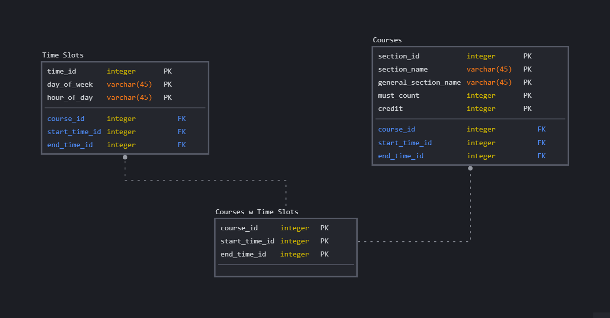

# Schedule Generator


## Description
This project aims to generate possible schedules for a set of lessons based on their timings and constraints. It is designed to retrieve course information from an SQLite database, process the data, and generate schedules accordingly. The schedules are validated against certain constraints to ensure their feasibility.

## Important Note
This project is for educational purposes only. Course information used in this application, including course names and details, is sourced from Özyeğin University for demonstration purposes only. However, actual course timings are used to provide realistic scheduling scenarios. This project does not represent actual course offerings or any confidential information from Özyeğin University 

## File Structure
- `app.py`: The main application file responsible for orchestrating the schedule generation process.
- `excel_to_sql.py`: A script for converting Excel files containing course information to an SQLite database format.
- `main.py`: Contains the core functions for processing course data, generating schedules, and validating them.
- `course.db`: An SQLite database file containing course information.
- `lessons/`: A directory containing Excel files with course information. (Note: Excel files are not shared.)
- `templates/`: This directory contains template files used for generating reports or exporting schedules in different formats.


## Setup Instructions
1. Ensure Python is installed on your system. If not, download and install Python from [python.org](https://www.python.org/).
2. Clone the repository: 
```console
git clone https://github.com/omeravci99/Schedule-Generator.git
``` 
3. Navigate to the project:
```console
cd Schedule-Generator
``` 
4. Install the required dependencies:
```console
pip install -r requirements.txt
```
5. Since Database is already created, you do not need to run `excel_to_sql.py`. To run the program:
```console
python app.py
``` 


## Usage
- After running the program, open the link in your browser and select courses you want to take by clicling 'ctrl'.
- Submit the form and possible scheduled will be displayed.
- You can download the image form of the schedule you liked.

## Database Diagram



## Contributing
- Contributions to this project are welcome. If you find any issues or have suggestions for improvements, feel free to open an issue or submit a pull request on the GitHub repository.

## Author
__Faruk Avcı__

## Contact
faruk.avci@ozu.edu.tr
